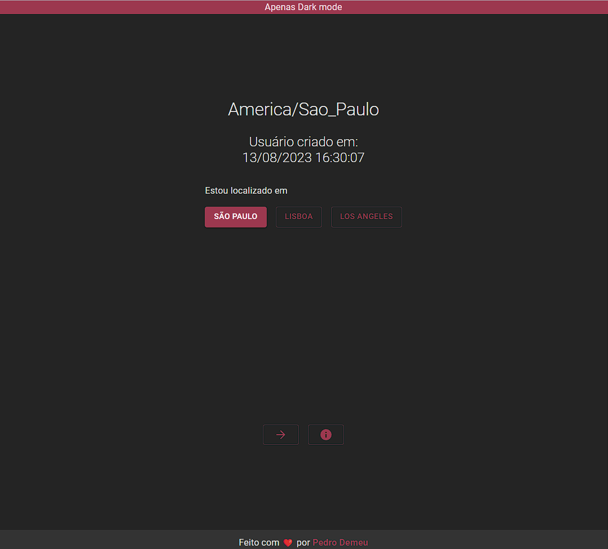
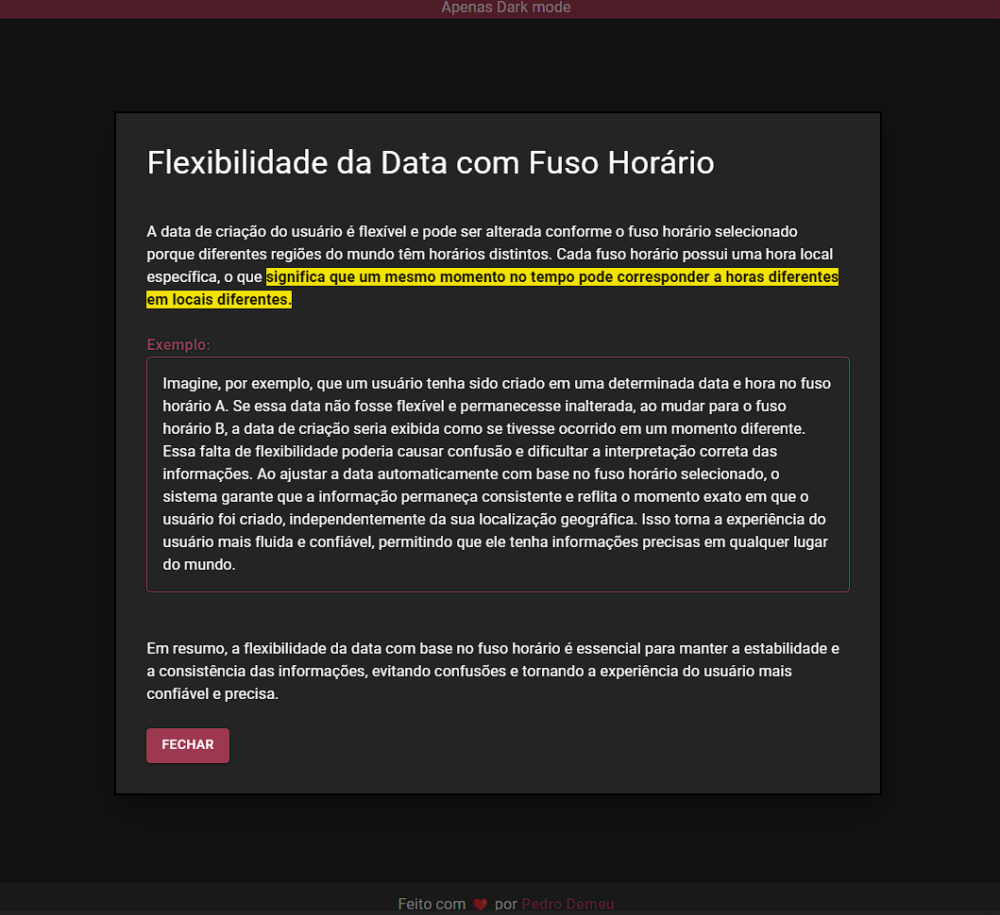
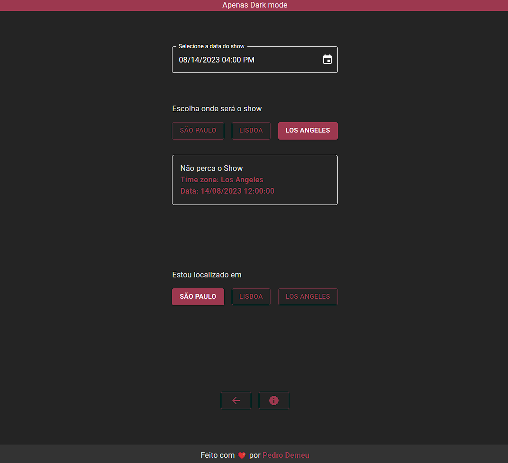
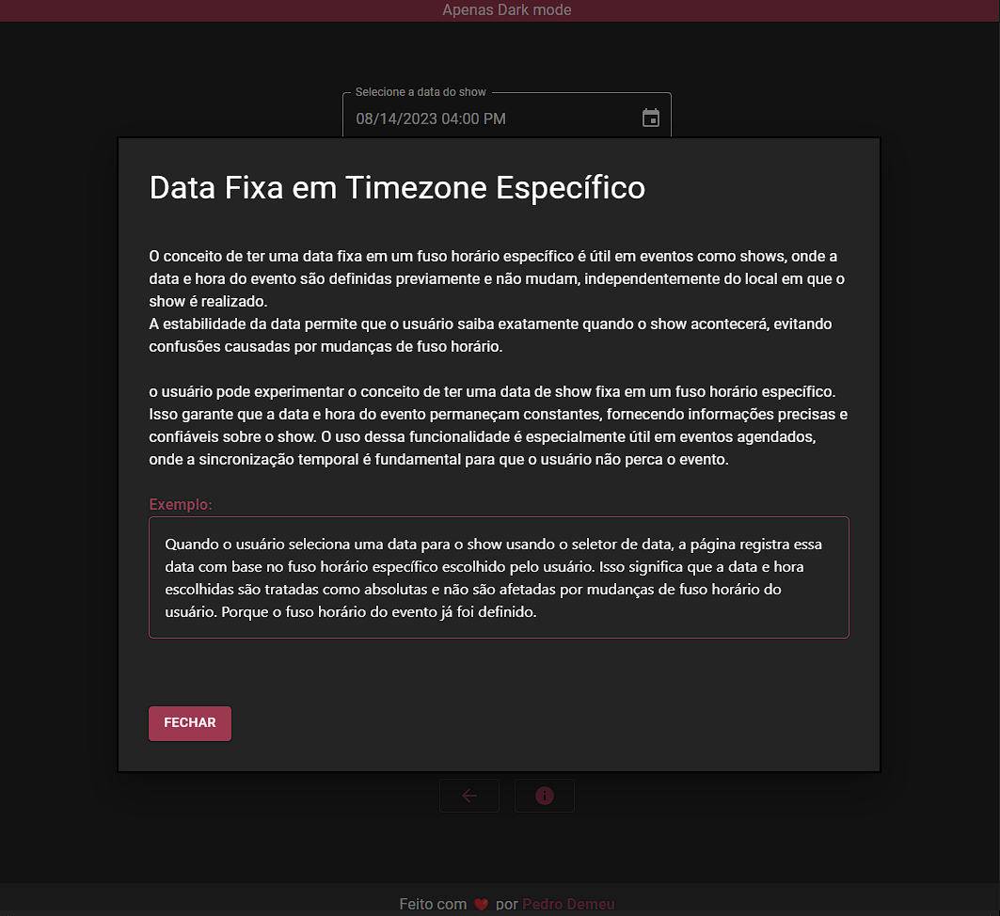
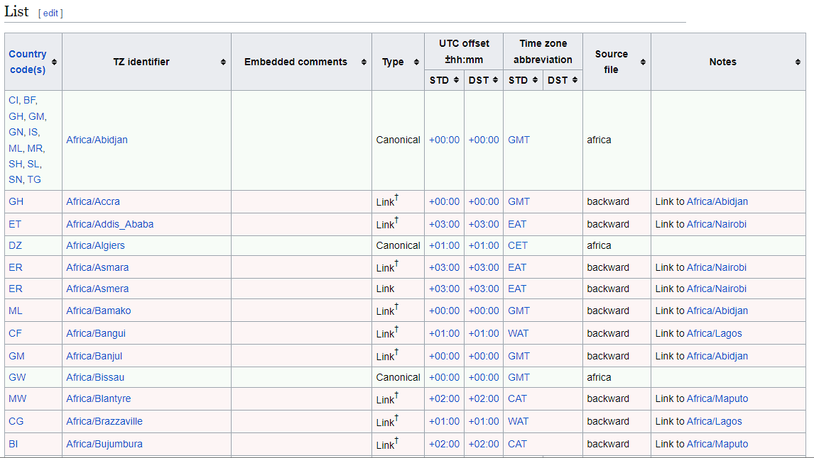

# TIMEZONES & UTC

## Trabalhando corretamente com Datas e Timezones





### Como rodar o projeto

- Faça Clone deste projeto
- Instale as dependências
- Inicie a aplicação

```
   git clone https://github.com/pedro-demeu/timezones-e-utc.git
   yarn
   yarn dev
```

## Anotações sobre o Estudo Feito

### MOTIVAÇÕES

<ul>
   <li>
         Ter uma informação comum entre todos os usuários.
   </li>
   <li>
         Data em UTC, fica fácil manipular quando tem alterações em horário de verão.
   </li>
   <li>
         Facilidade no armazenamento da informação
   </li>
   <li>
         Relatórios são mais fáceis de serem emitidos.
   </li>
   <li>
        Comparação de Datas (maior ou menor que x período)
   </li>
   <li>
        Timezone é apenas uma view
   </li>
</ul>

##### UTC (Tempo Universal Coordenado)

Basicamente é como representamos uma data em um ponto unico durante o mundo.
É muito interessante que usemos essa estratégia
para mostrar alguma informação de data no timezone do usuário independente do lugar no mundo
em que ele esteja.

#### GMT (GreenWich Mean Time Zone)

É um padrão de tempo utilizado como referência para coordenar o horário em diferentes partes do mundo. A hora GMT é baseada no meridiano de Greenwich, que fica em Londres, e é usada como ponto de referência para definir fusos horários e coordenar eventos internacionais

##### Existem 2 representações mais utilizadas em TI:

<ul>
   <li>Unix Time (número de milisegundos desde 01 de janeiro de 1970)</li>
   <li>ISO
</ul>

#### Exemplos:

<h3>Unix Time</h3>
<p>⚠️ Atenção:  os resultados abaixo, são baseados na data atual da minha máquina, e não um valor fixo.</p>

```
   new Date().getTime() // 1691954713415


   new Date(1691954713415) // Sun Aug 13 2023 16:25:13 GMT-0300 (Brasilia Standard Time)
```

<br>
<h3>ISO (8601)🌟</h3>

```
   new Date().toISOString() // '2023-08-03T20:13:46.213Z'

   new Date('2023-08-03T20:13:46.213Z') // Thu Aug 03 2023 17:13:46 GMT-0300 (Brasilia Standard Time)
```

<p> 🔑
   O "Z" ao final do timestamp "2023-08-03T20:13:46.213Z" indica a presença do UTC e representa a sigla "Zulu", que é o código de tempo utilizado para o UTC na linguagem militar e de aviação.
</p>

<hr>

#### Importante

##### Existe uma diferença entre uma data de exibição e uma data efetiva

##### Exemplo:

<ul>
   <li>Quando um usuário é criado (Apenas exibição da data)</li>
   <li>Quando acontece um evento físico (Mostrar data com fuso-horário do local)</li>
</ul>

<p>
   Por isso, é importante entender quando uma data pode ser relativa e só converte para timezone do usuário
   ou quando converte para um fuso-horário específico onde vai acontecer algo local.
</p>
<br>
<p>
   Outro exemplo, o Whatsapp, se alguém em londres te mandar mensagem às 21h40 do dia 03/08/23, você em SP, vai
   receber a mensagem instantaneamente e com a data do seu timezone (17h40 - 03/08/23).
</p>

<p>Podemos usar os nomes das timezones para converter uma data para qualquer horário que quisermos no mundo
desde que esteja em <b>UTC</b>
</p>

Fonte: <a target="_blank" href="https://en.wikipedia.org/wiki/List_of_tz_database_time_zones">https://en.wikipedia.org/wiki/List_of_tz_database_time_zones</a>


#### Bibliotecas importantes para lidar com data no javascript:

- date-fns
- date-fns-tz

#### 📚 Vale a pena ler:

- https://www.unixtimestamp.com/
- https://en.wikipedia.org/wiki/Unix_time
- https://developer.mozilla.org/pt-BR/docs/Web/JavaScript/Reference/Global_Objects/Date
- https://pt.wikipedia.org/wiki/ISO_8601
- https://time.is/UTC
- https://en.wikipedia.org/wiki/List_of_tz_database_time_zones
